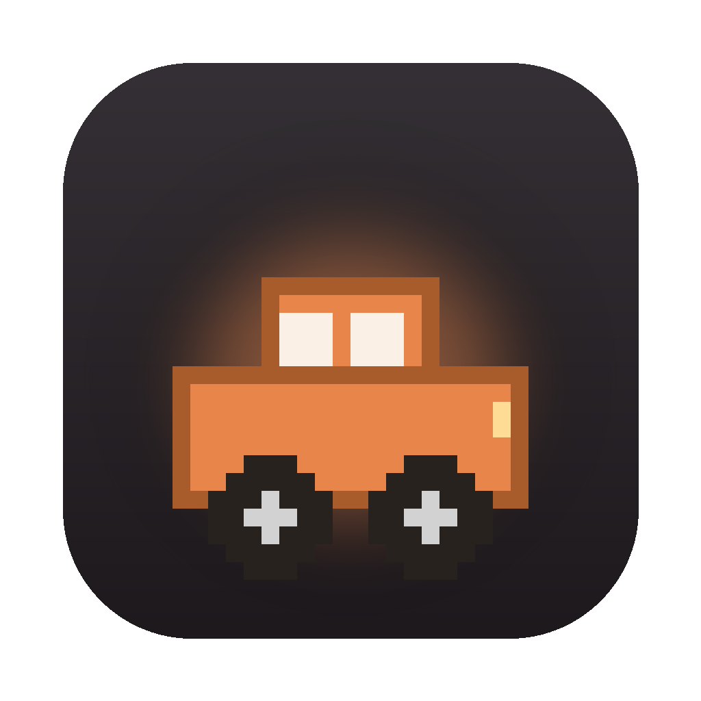
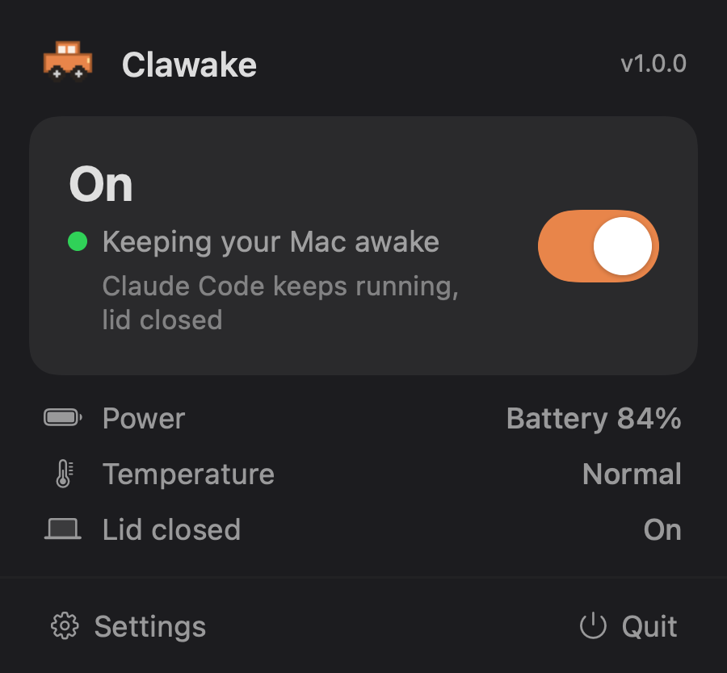

<div align="center">



# Clawake

**Keep your Mac awake, even with the lid closed.**

A tiny, native macOS menu bar app. Close the lid and your work keeps running: a build,
a local server, an SSH session, or a long agent task stays alive while the Mac is shut
in your bag or on your desk.


[](https://github.com/ItaiZeilig/clawake/releases/latest)

[**Download**](https://github.com/ItaiZeilig/clawake/releases/latest) · [Features](#features) · [How it works](#how-it-works) · [Build from source](#build-from-source)

</div>

<br/>


<br/>

## Why

macOS sleeps the moment you close the lid, and a sleeping Mac drops everything:
your build stops, your server goes offline, your remote session dies. Clawake keeps
the Mac awake so none of that happens. Start something long, shut the laptop, walk
away, and pick it back up from anywhere.

It is deliberately small. It lives only in the menu bar (a little car icon), has no
Dock icon, weighs about 2 MB, and does one thing well. No Electron, no background
bloat, no account.

## Features

| | |
|---|---|
| **Works with the lid closed** | Keeps the Mac awake through a shut lid, with no external display required. |
| **Your session survives** | Builds, servers, SSH, and agent runs keep going instead of freezing when the Mac would sleep. |
| **Auto-off timer** | Keep awake for 5m, 10m, 15m, 30m, 1h, 2h, 5h, or leave it unlimited. It turns itself off when time is up. |
| **Battery guard** | Pause automatically when the battery runs low, so a forgotten session does not drain the Mac. |
| **Cool-down protection** | Pause if the Mac runs hot, then resume once it cools. |
| **AC-only mode** | Optionally keep awake only while plugged in. |
| **Don't lock the screen** | Optionally keep the display on and unlocked while a task runs. |
| **Native and tiny** | Swift + AppKit + SwiftUI, about 2 MB, menu bar only, no Dock icon. |
| **Clean uninstall** | Restores normal sleep and removes its helper. Drag to the Trash and nothing is left behind. |

## Screenshots

<div align="center">

</div>

## Install

**Download the DMG** from the [latest release](https://github.com/ItaiZeilig/clawake/releases/latest),
open it, and drag Clawake to your Applications folder. The build is notarized by Apple
(Developer ID), so it opens with no Gatekeeper warning.

The car icon appears in your menu bar. Click it and flip the switch. To keep the Mac
awake with the lid **closed**, turn that option on in Settings and approve it once under
System Settings → General → Login Items & Extensions.

Requires macOS 13 (Ventura) or later. Universal binary, native on Apple Silicon and Intel.

## How it works

Clawake has two independent power layers.

1. **Light layer (lid open).** An `IOPMAssertion`
   (`kIOPMAssertionTypePreventUserIdleSystemSleep`) prevents idle system sleep. No root,
   works out of the box. This alone keeps the Mac awake while the lid is open.

2. **Deep layer (lid closed).** `pmset -a disablesleep` is what survives a closed lid.
   It needs root, so it runs through a signed **`SMAppService`** privileged daemon embedded
   in the app bundle and reached over **XPC**. The daemon verifies the caller's code
   signature before doing anything. You approve it once in Login Items, and there are no
   password prompts during use and no `sudoers` changes.

The deep layer only engages when you turn "lid closed" on and approve the helper, so the
app is useful immediately and never prompts unless you ask for lid-closed. It reconciles
the real system state on launch, so a crash never leaves your Mac permanently unable to sleep.

It works alongside a corporate screen-lock policy too: keep only the system awake, and the
screen still locks on your company's schedule while your session keeps running behind the lock.

## Build from source

Clawake is a Swift package (no `.xcodeproj`).

```sh
git clone https://github.com/ItaiZeilig/clawake.git
cd clawake
swift build -c release        # compile
swift test                    # run the unit tests
./build-app.sh                # assemble Clawake.app + DMG into release/
open release/Clawake.app       # run it (icon appears in the menu bar)
```

Xcode can open the folder directly (`File > Open`, or open `Package.swift`).

To produce a signed, notarized release, set your Developer ID identity and a stored
`notarytool` profile first:

```sh
export DEVID_IDENTITY="Developer ID Application: Your Name (TEAMID)"
export NOTARY_PROFILE="your-notarytool-profile"
./build-app.sh
```

## Project structure

Four SwiftPM targets, dependencies pointing inward toward pure logic:

```
ClawakeCore     pure logic (decisions, thermal, config), no AppKit/SwiftUI, unit-tested
ClawakeShared   the XPC protocol + constants, shared by the app and the daemon
ClawakeHelper   the privileged root daemon
Clawake         the menu bar app (App / Power / MenuBar / Settings / UI)
```

See [`CLAUDE.md`](CLAUDE.md) for a full file-by-file tour of the architecture.

## Editions

- **Standard** shows the "Don't lock the screen" option and can keep the display unlocked.
- **Enterprise** (`EDITION=enterprise ./build-app.sh`) keeps the Mac awake but never prevents
  the screen from locking, and hides that control, so it stays within a corporate screen-lock
  policy. Both editions share the same helper daemon.

## Contributing

Issues and pull requests are welcome. Clawake is intentionally simple (On / Off), so please
open an issue to discuss before adding new modes or settings. Keep it tiny and native.

## License

[MIT](LICENSE). Do what you like, no warranty.
